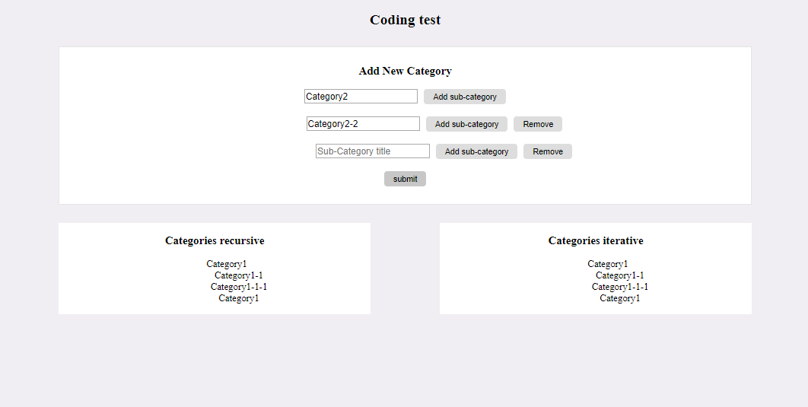

## CodingTest page

Simple page without style or script frameworks.

Excersise is printing a categories tree to the page (unlimited hierarchy) in two ways:
  - recursive;
  - iterative;  
	
> Example:
> - cat
>   - sub-cat
>     - sub-sub-cat
>   - sub-cat
>     - sub-sub-cat
>        - sub-sub-sub-cat
>    - sub-sub-cat
> - cat

> Page view:
 
